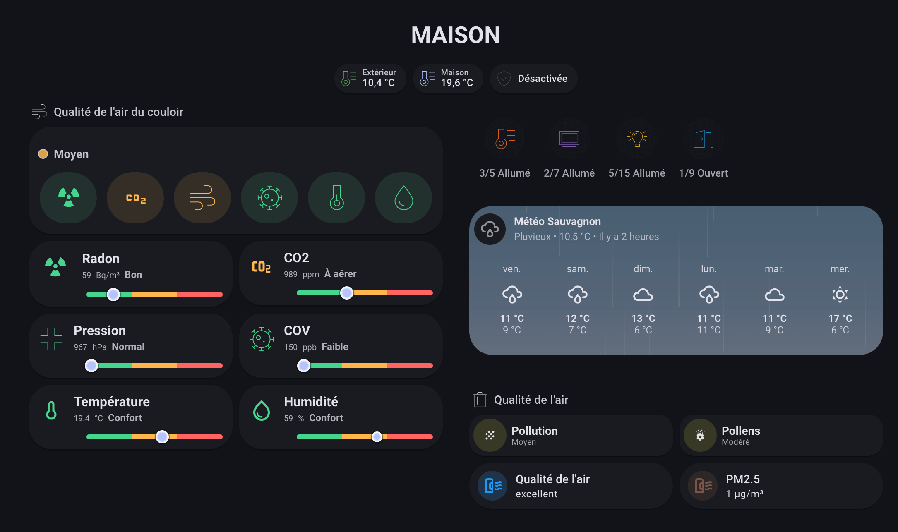

<div align="center">


<br>


[![HACS Custom][hacs_shield]][hacs]
[![Latest Version][version_shield]][releases]
[![Buy me a coffee][buy_me_a_coffee_shield]][buy_me_a_coffee]

</div>

<br>

# JP2 Air Quality Card

A **Home Assistant Lovelace** card with a clean **dashboard look** to display **air quality & comfort** at a glance  
(CO₂, VOC, radon, pressure, temperature, humidity…) with a **colored gauge**, a **status label**, an optional **AQI summary**, and an integrated **history graph**.

> [!NOTE]  
> If an option is not available in your version, it is simply ignored.

<br>

---

<br>


 ## Table of contents
-- **[Installation](#installation)**
-- **[Quick start](#quick-start)**
-- **[Examples](#examples)**
-- **[Options](#options)**
-- **[Visual editor](#visual-editor)**

<br>

---

<br>

## Installation

### Option A — HACS (Custom repository)

1. HACS → **Frontend**
2. Menu (⋮) → **Custom repositories**
3. Add:
   - Repository: `jp2creation/jp2-air-quality`
   - Category: `Lovelace`
4. Install the card
5. Refresh your browser cache

If the resource isn’t added automatically:

- Settings → Dashboards → Resources → Add  
- URL: `/hacsfiles/jp2-air-quality/jp2-air-quality.js`  
- Type: `Module`

<br>

### Option B — Manual

1. Copy **`jp2-air-quality.js`** to:
   - `/config/www/` (Lovelace path is `/local/`)
2. Add Lovelace resource:
   - Settings → Dashboards → Resources → Add  
   - URL: `/local/jp2-air-quality.js`  
   - Type: `Module`
3. Hard refresh the browser

> [!IMPORTANT]  
> The main file must stay named exactly **`jp2-air-quality.js`**.

<br>

---

<br>

## Quick start

```yaml
type: custom:jp2-air-quality
title: Air quality
entities:
  radon: sensor.radon_bq_m3
  co2: sensor.co2_ppm
  voc: sensor.voc_ppb
  pressure: sensor.pressure_hpa
  temperature: sensor.temperature_salon
  humidity: sensor.humidity_salon
```

<br>

---

<br>

## Examples

<details>
<summary><b>Minimal card (only CO₂)</b></summary>

<br>

```yaml
type: custom:jp2-air-quality
title: Living room
entities:
  co2: sensor.living_room_co2
```

</details>

<br>

<details>
<summary><b>Graph enabled (24h)</b></summary>

<br>

```yaml
type: custom:jp2-air-quality
title: Living room
show_graph: true
graph_hours: 24
entities:
  co2: sensor.living_room_co2
  temperature: sensor.living_room_temperature
  humidity: sensor.living_room_humidity
```

</details>

<br>

<details>
<summary><b>AQI summary (with thresholds)</b></summary>

<br>

```yaml
type: custom:jp2-air-quality
title: Living room

aqi:
  enabled: true
  hide_sensors: false
  sensors:
    - entity: sensor.living_room_co2
      label: CO2
      unit: ppm
      good: 800
      medium: 1200
    - entity: sensor.living_room_voc
      label: VOC
      unit: ppb
      good: 150
      medium: 300

entities:
  co2: sensor.living_room_co2
  voc: sensor.living_room_voc
  temperature: sensor.living_room_temperature
  humidity: sensor.living_room_humidity
```

</details>

<br>

<details>
<summary><b>AQI mode — hide the sensor list</b></summary>

<br>

```yaml
type: custom:jp2-air-quality
title: Living room

aqi:
  enabled: true
  hide_sensors: true
  sensors:
    - entity: sensor.living_room_co2
      label: CO2
      unit: ppm
      good: 800
      medium: 1200
    - entity: sensor.living_room_voc
      label: VOC
      unit: ppb
      good: 150
      medium: 300

entities:
  co2: sensor.living_room_co2
  voc: sensor.living_room_voc
```

</details>

<br>

<details>
<summary><b>AQI mode — horizontal layout + icons only</b></summary>

<br>

> [!TIP]  
> This mode is perfect for a compact “summary row”.

```yaml
type: custom:jp2-air-quality
title: Living room

aqi:
  enabled: true
  layout: horizontal
  icons_only: true
  sensors:
    - entity: sensor.living_room_co2
      label: CO2
      unit: ppm
      good: 800
      medium: 1200
    - entity: sensor.living_room_voc
      label: VOC
      unit: ppb
      good: 150
      medium: 300
    - entity: sensor.living_room_radon
      label: Radon
      unit: Bq/m³
      good: 100
      medium: 300

entities:
  co2: sensor.living_room_co2
  voc: sensor.living_room_voc
  radon: sensor.living_room_radon
```

</details>

<br>

<details>
<summary><b>AQI title — add an image and/or an icon on the left</b></summary>

<br>

```yaml
type: custom:jp2-air-quality
title: Living room

aqi:
  enabled: true

  # Left of “AQI”
  title_icon: mdi:air-filter
  title_image: /local/icons/air-quality.png

  sensors:
    - entity: sensor.living_room_co2
      label: CO2
      unit: ppm
      good: 800
      medium: 1200

entities:
  co2: sensor.living_room_co2
```

</details>

<br>

<details>
<summary><b>Icon styling (no background + no ring)</b></summary>

<br>

```yaml
type: custom:jp2-air-quality
title: Living room

icon:
  size: 44
  show_background: false
  show_circle: false

entities:
  co2: sensor.living_room_co2
  temperature: sensor.living_room_temperature
  humidity: sensor.living_room_humidity
```

</details>

<br>

---

<br>

## Options

### General

| Name | Type | Default | Description |
| --- | --- | --- | --- |
| `title` | string | — | Card title |
| `entities` | object | — | Sensors mapping: `co2`, `voc`, `radon`, `pressure`, `temperature`, `humidity`… |

<br>

### Graph

| Name | Type | Default | Description |
| --- | --- | --- | --- |
| `show_graph` | boolean | `false` | Enable built-in history graph |
| `graph_hours` | number | `24` | History window in hours |

<br>

### Icon

| Name | Type | Default | Description |
| --- | --- | --- | --- |
| `icon.size` | number | `44` | Icon size (px) |
| `icon.show_background` | boolean | `true` | Show/hide icon background |
| `icon.show_circle` | boolean | `true` | Show/hide icon ring |

<br>

### AQI (Air Quality Index)

| Name | Type | Default | Description |
| --- | --- | --- | --- |
| `aqi.enabled` | boolean | `false` | Enable AQI summary mode |
| `aqi.hide_sensors` | boolean | `false` | Hide the sensor list in AQI mode |
| `aqi.layout` | string | `vertical` | AQI layout (`vertical` / `horizontal`) |
| `aqi.icons_only` | boolean | `false` | In horizontal layout: only show icons (hide the rest) |
| `aqi.title_icon` | string | — | Optional left icon (e.g. `mdi:air-filter`) |
| `aqi.title_image` | string | — | Optional left image (e.g. `/local/...png`) |
| `aqi.sensors` | array | `[]` | AQI sensors list with thresholds |

#### `aqi.sensors[]` item

| Field | Type | Required | Description |
| --- | --- | --- | --- |
| `entity` | string | ✅ | HA entity (ex: `sensor.co2_ppm`) |
| `label` | string | ✅ | Display name |
| `unit` | string | ❌ | Display unit (ppm/ppb/…) |
| `good` | number | ✅ | “Good” threshold |
| `medium` | number | ✅ | “Medium” threshold (above = “Bad”) |

> [!IMPORTANT]  
> If you previously used the `iqa:` key, update it to `aqi:`.

<br>

---

<br>

## Visual editor

<br>

V2.0.0 includes a full redesign of the visual editor:
- smoother UI / fewer freezes
- clearer settings sections
- more stable behavior when enabling **AQI** and/or **Graph**
- cleaner internal structure for easier maintenance

<br>

---

<br>

## Troubleshooting

### Card not showing / “Custom element doesn’t exist”
- Check the resource path (`/local/...` or `/hacsfiles/...`)
- Ensure the resource type is **Module**
- Hard refresh the browser

### Old version still loaded
- Clear browser cache  
- Or use a cache buster: `/local/jp2-air-quality.js?v=2`

### Graph is empty
- Recorder/history must be enabled
- The entity state must be numeric

### Freeze when enabling AQI
- Update to the latest version (includes stability improvements and visual editor updates)

<br>

---

<br>

## Development

Copy `jp2-air-quality.js` into `/config/www/`  
Add resource: `/local/jp2-air-quality.js?v=dev`  
Hard refresh browser after each change.

Tip: keeping `?v=dev` helps bypass cache while iterating.

<br>

---

<br>

## Contributing

Please open an Issue with:
- Home Assistant version
- YAML config (remove sensitive info)
- Console logs (F12)

PR workflow:
1. Fork
2. Create a branch: `feature/my-feature`
3. Clean commits
4. Pull Request

<br>

---

<br>

## Changelog

See GitHub releases: **[Releases][releases]**

<br>

---

<br>

## License

MIT — see `LICENSE`.

<br>

---

<br>

## Support

If this project helps you, you can support it here: **[Buy me a coffee][buy_me_a_coffee]**

<br>

---

<!-- Reference links -->
[hacs_shield]: https://img.shields.io/badge/HACS-Custom-orange.svg
[hacs]: https://hacs.xyz/docs/faq/custom_repositories/
[version_shield]: https://img.shields.io/badge/Lovelace-Home_Assistant-blue
[downloads_total_shield]: https://img.shields.io/github/downloads/jp2creation/jp2-air-quality/total
[releases]: https://github.com/jp2creation/jp2-air-quality/releases
[buy_me_a_coffee_shield]: https://img.shields.io/badge/Buy%20me%20a%20coffee-support-yellow.svg
[buy_me_a_coffee]: https://www.buymeacoffee.com/jp2creation

